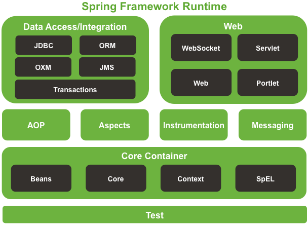

# Spring, SpringBoot Interview Question

### Table of Contents

| Questions                                                                                               |
| ------------------------------------------------------------------------------------------------------- |
| [What is Spring](#What-is-Spring)                                                                       |
| [What is Spring Boot](#What-is-Spring-Boot)                                                             |
| [What is Client Server Architecture](#What-is-Client-Server-Architecture)                               |
| [What is Spring Boot Architecture](#What-is-Spring-Boot-Architecture)                                   |
| [Types of Spring Boot applications](#Types-of-Spring-Boot-applications)                                 |
| [What is Rest](#What-is-Rest)                                                                           |
| [What is Resource](#What-is-Resource)                                                                   |
| [What is Http Request Methods](#What-is-Http-Request-Methods)                                           |
| [What is Http Response Codes](#What-is-Http-Response-Codes)                                             |
| [What is Inversion of Control](#What-is-Inversion-of-Control)                                           |
| [What is Dependency Injection](#What-is-Dependency-Injection)                                           |
| [Spring framework modules](#Spring-framework-modules)                                                   |
| [What is Reference Type Injecting](#What-is-Reference-Type-Injecting)                                   |
| [How to Injecting Reference Type Injecting](#How-to-Injecting-Reference-Type)                           |
| [What is Constructor Injection](#What-is-Constructor-Injection)                                         |
| [What is LifeCycle Method of Spring Beans](#What-is-LifeCycle-Method-of-Spring-Beans)                   |
| [Type of LifeCycle work](#Type-of-LifeCycle-work)                                                       |
| [How many type of Configure Technique](#How-many-type-of-Configure-Technique)                           |
| [What is Annotations](#What-is-Annotations)                                                             |
| [What is PostConstruct](#What-is-PostConstruct)                                                         |
| [What is PreDestroy](#What-is-PreDestroy)                                                               |
| [What is Autowiring in spring](#What-is-Autowiring-in-spring)                                           |
| [How many type of Autowiring perform](#How-many-type-of-Autowiring-perform)                             |
| [Advantage of Autowiring](#Advantage-of-Autowiring)                                                     |
| [Disadvantage of Autowiring](#Disadvantage-of-Autowiring)                                               |
| [What is Qualifier Annotation](#What-is-Qualifier-Annotation)                                           |
| [What is Spring Standalone Collections in xml file](#What-is-Spring-Standalone-Collections-in-xml-file) |
|                                                                                                    |
|                                                                                                    |
|                                                                                                    |
|                                                                                                    |
|                                                                                                    |
|                                                                                                    |
|                                                                                                    |
|                                                                                                    |
|                                                                                                    |
|                                                                                                    |
|                                                                                                    |
|                                                                                                    |
|                                                                                                    |
|                                                                                                    |
|                                                                                                    |
|                                                                                                    |
|                                                                                                    |
|                                                                                                    |
|                                                                                                    |
|                                                                                                    |
|                                                                                                    |
|                                                                                                    |
|                                                                                                    |
|                                                                                                    |
|                                                                                                    |
|                                                                                                    |
|                                                                                                    |
|                                                                                                    |
|                                                                                                    |
|                                                                                                    |
|                                                                                                    |
|                                                                                                    |
|                                                                                                    |
|                                                                                                    |
|                                                                                                    |
|                                                                                                    |
|                                                                                                    |
|                                                                                                    |
|                                                                                                    |
|                                                                                                    |
|                                                                                                    |
|                                                                                                    |
|                                                                                                    |

---
### What is Spring

Spring is a Dependency Injection framework to make java application loosely coupled.
Spring framework makes the easy development of JavaEE application.
It was developed by Rod Johnson in 2003.

**[⬆ Back to Top](#table-of-contents)**

---

### What is Spring Boot

Spring Boot is a tool that simplifies Spring development by providing auto-configuration, embedded servers, and ready-to-run applications with minimal setup.

**[⬆ Back to Top](#table-of-contents)**

---

### What is Client Server Architecture

Client-server architecture is a model where clients request services from a central server, which processes and delivers them over a network.

**[⬆ Back to Top](#table-of-contents)**

---

### What is Spring Boot Architecture

**[⬆ Back to Top](#table-of-contents)**

---

### Types of Spring Boot applications

Here's a brief overview of the various types of Spring Boot applications:

1. **Reactive Application:**  
   - **Description:** Non-blocking, asynchronous applications designed for high concurrency and low resource usage.  
   - **Tech:** Spring WebFlux, Project Reactor.  
   - **Use Cases:** Real-time systems, streaming data services.

2. **Web Application:**  
   - **Description:** Traditional server-side applications serving web pages or APIs.  
   - **Tech:** Spring MVC, Thymeleaf, REST APIs.  
   - **Use Cases:** E-commerce sites, content management systems.

3. **Standalone Application:**  
   - **Description:** Self-contained applications running locally on a machine.  
   - **Tech:** Embedded servers (Tomcat, Jetty), Spring Boot CLI.  
   - **Use Cases:** Desktop utilities, command-line tools.

4. **Microservices Application:**  
   - **Description:** Small, independently deployable services forming part of a larger system.  
   - **Tech:** Spring Cloud, Spring Boot Actuator, Docker/Kubernetes.  
   - **Use Cases:** Large-scale distributed systems, enterprise applications.

5. **Batch Application:**  
   - **Description:** Processes large volumes of data in scheduled batch jobs.  
   - **Tech:** Spring Batch, job scheduling (Quartz).  
   - **Use Cases:** Data migration, report generation.

6. **Command-Line Application:**  
   - **Description:** Runs tasks from the command line or background without user interaction.  
   - **Tech:** CommandLineRunner, ApplicationRunner.  
   - **Use Cases:** Automation scripts, data processing tasks.

7. **Serverless Application:**  
   - **Description:** Runs in serverless environments, triggered by events.  
   - **Tech:** AWS Lambda, Spring Cloud Function.  
   - **Use Cases:** Event-driven applications, lightweight services.

8. **API Gateway:**  
   - **Description:** Central entry point managing requests to microservices.  
   - **Tech:** Spring Cloud Gateway.  
   - **Use Cases:** Securing APIs, routing traffic, managing cross-cutting concerns.

9. **Reactive WebSocket Application:**  
   - **Description:** Real-time communication using WebSockets for low-latency interaction.  
   - **Tech:** Spring WebFlux WebSocket, Project Reactor.  
   - **Use Cases:** Chat applications, live updates, collaborative platforms.

**[⬆ Back to Top](#table-of-contents)**

---

### What is Rest

**REST** is a web service design style that uses HTTP methods to interact with resources, focusing on simplicity and stateless communication. The term **"REST"** stands for "Representational State Transfer."

**[⬆ Back to Top](#table-of-contents)**

---

### What is Resource

A resource is a representation of a real-world or conceptual entity that can be accessed and manipulated through a web service using standard HTTP methods.

**[⬆ Back to Top](#table-of-contents)**

---

### What is Http Request Methods

HTTP request methods specify actions on resources: **GET** retrieves data, **POST** creates or updates, **PUT** replaces, **DELETE** removes, and **PATCH** makes partial updates to a resource.

**[⬆ Back to Top](#table-of-contents)**

---

### What is Http Response Codes

HTTP response codes are three-digit numbers indicating the result of a request, showing success, errors, or required actions.

| **Code**                      | **Description**                                                                      |
| ----------------------------- | ------------------------------------------------------------------------------------ |
| **200 OK**                    | The request was successful, and the server returned the requested data.              |
| **201 Created**               | The request was successful, and a new resource was created.                          |
| **204 No Content**            | The request was successful, but there is no content to return.                       |
| **400 Bad Request**           | The request was invalid or malformed, often due to client error.                     |
| **401 Unauthorized**          | Authentication is required, or credentials provided are invalid.                     |
| **403 Forbidden**             | The server understands the request but refuses to authorize it.                      |
| **404 Not Found**             | The requested resource could not be found on the server.                             |
| **500 Internal Server Error** | The server encountered an error while processing the request.                        |
| **502 Bad Gateway**           | The server received an invalid response from an upstream server.                     |
| **503 Service Unavailable**   | The server is currently unable to handle the request due to overload or maintenance. |

**[⬆ Back to Top](#table-of-contents)**

---

### What is Inversion of Control

Inversion of Control (IoC) is a design principle where control flow is inverted: higher-level modules manage and inject dependencies into lower-level ones.

**[⬆ Back to Top](#table-of-contents)**

---

### What is Dependency Injection

Dependency Injection is a design pattern in which an object receives its dependencies from an external source rather than creating them.

**[⬆ Back to Top](#table-of-contents)**

---

### Spring framework modules

**[⬆ Back to Top](#table-of-contents)**

---

###

**[⬆ Back to Top](#table-of-contents)**

---

###

**[⬆ Back to Top](#table-of-contents)**

---

###

**[⬆ Back to Top](#table-of-contents)**

---

###

**[⬆ Back to Top](#table-of-contents)**

---

###

**[⬆ Back to Top](#table-of-contents)**

---

###

**[⬆ Back to Top](#table-of-contents)**

---

###

**[⬆ Back to Top](#table-of-contents)**

---

###

**[⬆ Back to Top](#table-of-contents)**

---

###

**[⬆ Back to Top](#table-of-contents)**

---

###

**[⬆ Back to Top](#table-of-contents)**

---

###

**[⬆ Back to Top](#table-of-contents)**

---

###

**[⬆ Back to Top](#table-of-contents)**

---

###

**[⬆ Back to Top](#table-of-contents)**

---

###

**[⬆ Back to Top](#table-of-contents)**

---

###

**[⬆ Back to Top](#table-of-contents)**

---

###

**[⬆ Back to Top](#table-of-contents)**

---

###

**[⬆ Back to Top](#table-of-contents)**

---